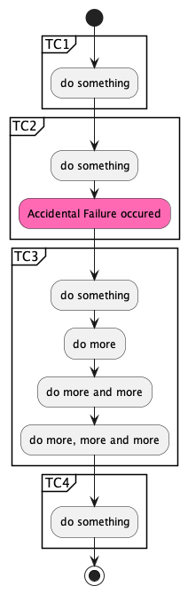

-   <a href="#conditional-test-case-execution-in-test-suite-in-katalon-studio" id="toc-conditional-test-case-execution-in-test-suite-in-katalon-studio">Conditional Test Case Execution in Test Suite in Katalon Studio</a>
    -   <a href="#problem-to-solve" id="toc-problem-to-solve">Problem to solve</a>
    -   <a href="#proposed-solution" id="toc-proposed-solution">Proposed Solution</a>
    -   <a href="#solution-explained" id="toc-solution-explained">Solution Explained</a>
        -   <a href="#installing-the-jar-file" id="toc-installing-the-jar-file">Installing the jar file</a>
        -   <a href="#create-a-test-listener" id="toc-create-a-test-listener">Create a Test Listener</a>
        -   <a href="#sample-codes-explained" id="toc-sample-codes-explained">Sample codes explained</a>
    -   <a href="#test-suitestsa" id="toc-test-suitestsa">Test Suites/TSa</a>
    -   <a href="#test-suitestsb" id="toc-test-suitestsb">Test Suites/TSb</a>
    -   <a href="#test-suitestcs" id="toc-test-suitestcs">Test Suites/TCs</a>

# Conditional Test Case Execution in Test Suite in Katalon Studio

## Problem to solve

In the following repository, you can find a set of codes for explanation.

-   [ConditionalTestCaseExecutionInTestSuite-demo](https://github.com/kazurayam/ConditionalTestCaseExecutionInTestSuite-demo)

In this repository, I have a Katalon Studio project with a Test Suite named `TSa`. The `TSa` consists of 4 Test Cases: `TCa1`, `TCa2`, `TCa3` and `TCa4`. The `TSa` will invoke 4 Test Cases just sequentially. The `TCa1`, `TCa2` and `TCa4` --- these run quickly in a few seconds; but the `TCa3` could run long (20 secs, 2 minutes, 20 minutes, 2 hours …​).

Regardless accidentally or intentionally, the `TCa2` could fail. Even if the `TCa2` failed, the Test Suite `TSa` will continue invoking the following Test cases `TCa3` and `TCa4`. See the following screenshot.

Now I introduce a condition:

> When the `TCa2` failed, I do not like to wait for the long-running `TCa3` to finish, because (due to some sensible reasons) the `TCa3` is not worth executing if its preceding `TCa2` failed. Rather I want the Test Suite to stop so that I can start debugging the `TCa2` as soon as possible.

In the Katalon Studio GUI, I would be watching it and would notice any failures during a Test Suite run. Then I would able stop the Test Suite by some manual intervention (clicking a "stop" button). But in the Katalon Runtime Engine, we have very little chance to intervene the progress of a Test Suite run. When the `TCa2` failed, still the `TCa3` will be invoked. We are supposed to wait for the `TCa3` to finish. We have no other option. This is the problem.

## Proposed Solution

This project provides a jar file which contains a Groovy class named

-   [`com.kazurayam.ks.TestCaseResults`](https://github.com/kazurayam/ConditionalTestCaseExecutionInTestSuite/blob/develop/Keywords/com/kazurayam/ks/TestCaseResults.groovy)

which is supposed to be used in a [Katalon Studio](https://katalon.com/katalon-studio) project. Here is a sample Test Case script that utilizes it:

    // Test Cases/conditional-withFailure/TCb3

    import com.kazurayam.ks.TestCaseResults

    import com.kms.katalon.core.webui.keyword.WebUiBuiltInKeywords as WebUI
    import com.kms.katalon.core.model.FailureHandling as FailureHandling

    TestCaseResults.assertTestCasePASSED("conditional-withFailure/TCb2")
        
    WebUI.comment("conditional-withFailure/TCb3 is running")
    WebUI.delay(5)
    WebUI.comment("conditional-withFailure/TCb3 is running still")
    WebUI.delay(5)
    WebUI.comment("conditional-withFailure/TCb3 is running yet")
    WebUI.delay(5)
    WebUI.comment("conditional-withFailure/TCb3 is running even more")
    WebUI.delay(5)

This is a Test Case named `TCb3`. The `TCb3` is bundled in a Test Suite named `TSb` which consists of 4 Test Cases: `TCb1`, `TCb2`, `TCb3` and `TCb4`. These 4 Test Cases will be executed just sequentially.

Look at the souce code; the `TCb3` is calling `TestCaseResults.assertTestCasePASSED("conditional-withFailure/TCb2")`. With this statement, the `TCb3` can make an assertion if the preceding Test Case `"conditional-withFailure/TCb2"` had its status `PASSED` or not. If the `TCb2` is found `PASSED`, the call to `assertTestCasePassed` will silently return. Then the `TCb3` will continue its processing. If the `TCb2` is found to have the status not `PASSED`, the call to `assertTestCasePASSED()` will raise a `StepFailedException`. Effectively the Test Case `TCb3` will skip its processing body.

The `TestCaseResults.assertTestCasePASSED(String testCaseId)` enables you to conditionally execute your Test Case depending on the result of preceding Test Case in a Test Suite. **In each Test Case scripts, you can optionally call `TestCaseResult.assertTestCasePASSED(precedingTestCaseId)` to determine if it should quit soon or continue its long running test processing.**

## Solution Explained

### Installing the jar file

A jar file that contains `com.kazurayam.ks.TestCaseResult` class is downloadable at the [Releases page](https://github.com/kazurayam/ConditionalTestCaseExecutionInTestSuite/releases/). You want to create your own Katalon Studio project. Download the jar into the `Drivers` folder in the project.

### Create a Test Listener

You have to create a List Listener code. The name of Test Listener can be any; for example `TL1`. The code should be like this:

    import com.kazurayam.ks.TestCaseResults
    import com.kms.katalon.core.annotation.AfterTestCase
    import com.kms.katalon.core.annotation.AfterTestSuite
    import com.kms.katalon.core.context.TestCaseContext
    import com.kms.katalon.core.context.TestSuiteContext

    class TL1 {
        
        @AfterTestCase
        def afterTestCase(TestCaseContext testCaseContext) {
            TestCaseResults.put(testCaseContext)
        }
        
        @AfterTestSuite
        def afterTestSuite(TestSuiteContext testSuiteContext) {
            TestCaseResults.println()
        }

    }

You do not need to customize it. Just copy & paste this sample.

This code transfers the result of all Test Cases in a Test Suite to the instance of `com.kazurayam.ks.TestCaseResults` class. This code is mandatory to let the `TestCaseResults` instance be able to serve the `assertTestCasePASSED(String testCaseId)` method.

### Sample codes explained

## Test Suites/TSa

## Test Suites/TSb

## Test Suites/TCs

