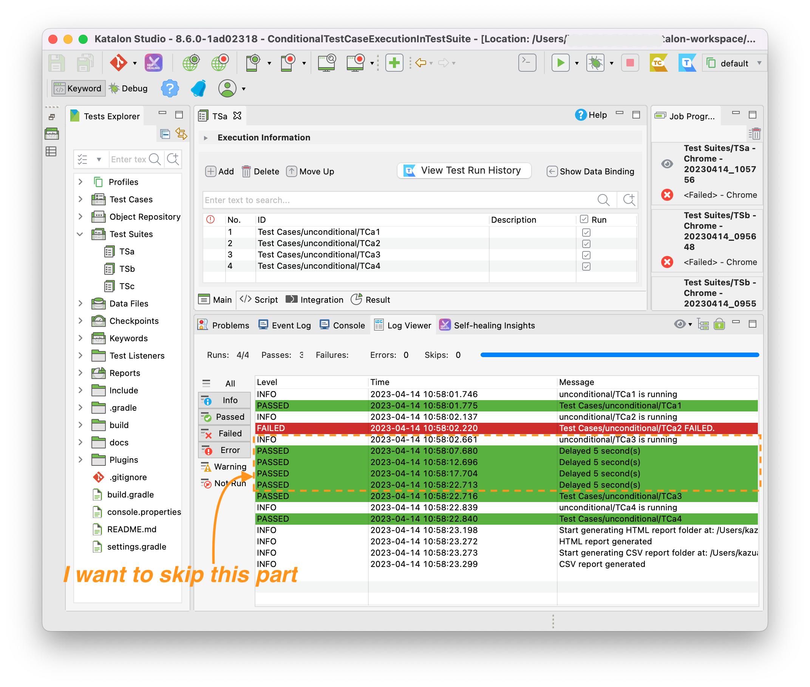
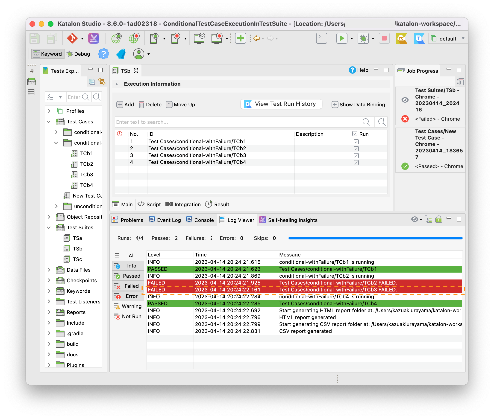

= Conditional Test Case Execution in Test Suite in Katalon Studio

== Problem to solve

In the following repository, you can find a set of codes for explanation.

* link:https://github.com/kazurayam/ConditionalTestCaseExecutionInTestSuite-demo[ConditionalTestCaseExecutionInTestSuite-demo]

In this repository, you will find a link:https://katalon.com/[Katalon Studio] project with a Test Suite named `TSa`. The `TSa` consists of 4 Test Cases: `TCa1`, `TCa2`, `TCa3` and `TCa4`. The `TSa` will invoke 4 Test Cases just sequentially. The `TCa1`, `TCa2` and `TCa4` --- these 3 will finish quickly in a few seconds; but the `TCa3` could run long (20 seconds, actually).

Regardless accidentally or intentionally, the `TCa2` could fail. Even if the `TCa2` failed, the Test Suite `TSa` will continue invoking the following Test cases `TCa3` and `TCa4`, as the following screenshot shows:

Please note that:

1. The Test Case `TCa2` failed intentionally.
2. The Test Case `TCa3` was invoked and took 20 seconds to finish.
3. The Test Suite `TSa` took 23 seconds to finish.

Now I introduce a condition:

[quote]
____
When the `TCa2` failed, I do not like to wait for the `TCa3` to finish, because the `TCa3` is no longer worth executing (due to some reasons) when its predecessor `TCa2` failed. Rather I want to stop the Test Suite as soon as possible so that I can start debugging the `TCa2`.
____

In the Katalon Studio GUI, I would keep watching it. I would notice any failures during a Test Suite runs, and I would able to stop the Test Suite by some manual intervention (clicking a "stop" button).

But the Katalon Runtime Engine provides very little chance to intervene the progress of a Test Suite run. When the `TCa2` failed, still the `TCa3` will be invoked. We have to wait for the `TCa3` to finish (for 20 seconds, 2 minutes, 20 minutes or possibly 2 hours) before we can start trouble-shooting the `TCa2`'s failure'. No other option is provided by Katalon.

== Proposed Solution

This project provides a jar file which contains a Groovy class named

* link:https://github.com/kazurayam/ConditionalTestCaseExecutionInTestSuite/blob/develop/Keywords/com/kazurayam/ks/TestCaseResults.groovy[`com.kazurayam.ks.TestCaseResults`]

which is supposed to be used in a link:https://katalon.com/katalon-studio[Katalon Studio] project. Here is a sample Test Case script that utilizes it:

[source,groovy]
----
include::../Scripts/conditional-withFailure/TCb3/Script1681386955295.groovy[]
----

This is a Test Case named `TCb3`. The `TCb3` is bundled in a Test Suite named `TSb` which consists of 4 Test Cases: `TCb1`, `TCb2`, `TCb3` and `TCb4`. These 4 Test Cases will be executed just sequentially.

Let's read the source code; the `TCb3` is calling
[source]
----
TestCaseResults.assertTestCasePASSED("conditional-withFailure/TCb2")`
----

With this statement, the `TCb3` makes an assertion that a Test Case `"conditional-withFailure/TCb2"` ran and finished `PASSED` before the `TCb3`. If the `TCb2` is found `PASSED`, the call to `assertTestCasePASSED()` will return silent. The `TCb3` will continue its processing. If the `TCb2` is found Not `PASSED`, the call to `assertTestCasePASSED()` will raise a `StepFailedException`. The `TCb3` will quit soon, it will skip its processing body. A call to `TestCaseResults.assertTestCasePASSED(String testCaseId)` enables you to conditionally execute your Test Case depending on the result of preceding Test Case in a Test Suite.

== Solution Explained

=== Installing the jar file

A jar file that contains `com.kazurayam.ks.TestCaseResult` class is downloadable at the link:https://github.com/kazurayam/ConditionalTestCaseExecutionInTestSuite/releases/[Releases page]. You want to create your own Katalon Studio project. Download the jar into the `Drivers` folder in the project.

=== Create a Test Listener

You have to create a Test Listener. The name of Test Listener can be any. For example `TL1`. The code should be like this:

[source]
----
include::../Test Listeners/TL1.groovy[]
----

You would not need to customize it. Just copy & paste this sample.

This code transfers the execution results of Test Cases in a Test Suite to the instance of `com.kazurayam.ks.TestCaseResults` class. This code is mandatory to inform the `TestCaseResults` instance of the Test Cases' result so that it can serve useful  `assertTestCasePASSED(String testCaseId)` method.

=== Sample codes explained

Test Suite `TSb` consists of 4 Test Cases: `TCb1`, `TCb2`, `TCb3` and `TCb4`.

==== `TCb1`
[source]
----
include::../Scripts/conditional-withFailure/TCb1/Script1681386955287.groovy[]
----

==== `TCb2`
[source]
----
include::../Scripts/conditional-withFailure/TCb2/Script1681386955291.groovy[]
----

Please note that `TCb2` will fail intentionally for demonstration purpose.

==== `TCb3`
[source]
----
include::../Scripts/conditional-withFailure/TCb3/Script1681386955295.groovy[]
----

Please note that `TCb3` asserts that the preceding `TCb2` passed. If the `TCb2` is found NOT passed, then the `TCb3` will quit soon without doing its long-running processing.

==== `TCb4`
[source]
----
include::../Scripts/conditional-withFailure/TCb4/Script1681386955283.groovy[]
----

==== How the `TSb` ran

When I ran the `TSb`, I saw the following result:

Please note the following points:

1. The Test Case `TCb2` failed intentionally
2. The Test Case `TCb3` was started, and failed quickly without performing is long-running processing.
3. The Test Suite `TSb` finished in 2 seconds.

Principally, The Test Suite `TSa` and `TSb` are quite similar. Both does the same _test processing_. However the `TSb` behaves quite differently from the `TSa` when any of Test Case failed. The `TSb` is enabled to execute Test Cases conditionally using the `com.kazurayam.ks.TestCaseResults.assertTestCasePASSED(String testCaseId)` method call. So a Test Suite empowered by the `assertTestCasePASSED` can finish as soon as its member Test Cases failed.

No longer you need to wait for a long-running Test Suite to finish after a failure even in the Katalon Runtime Engine.
